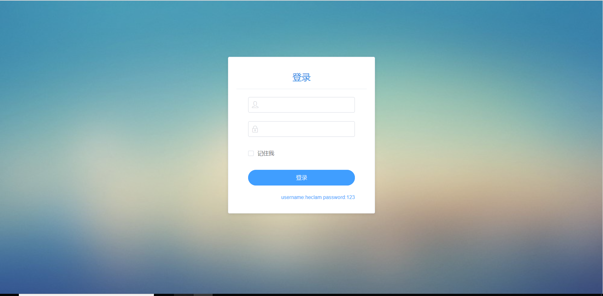
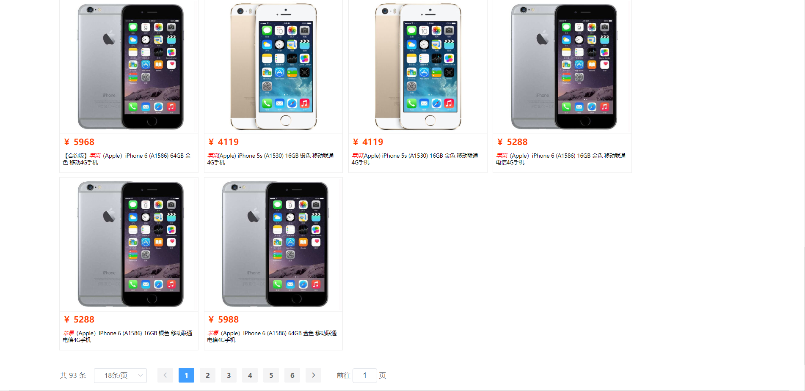
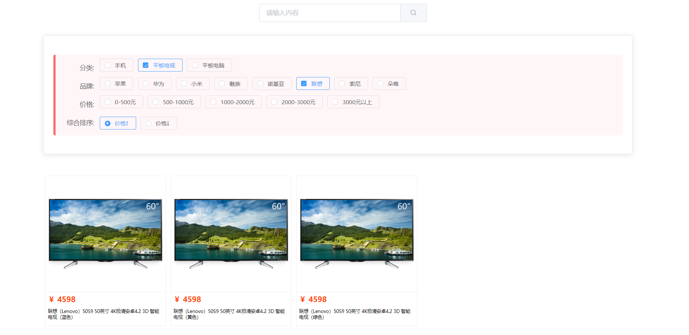
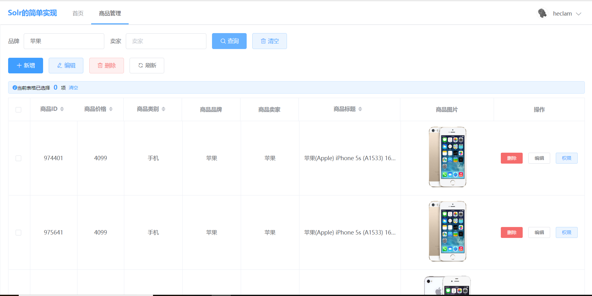
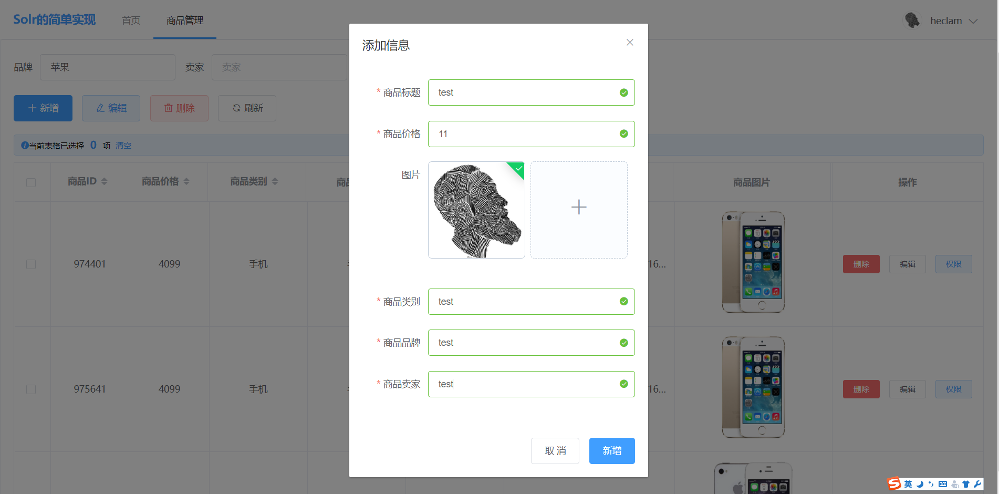
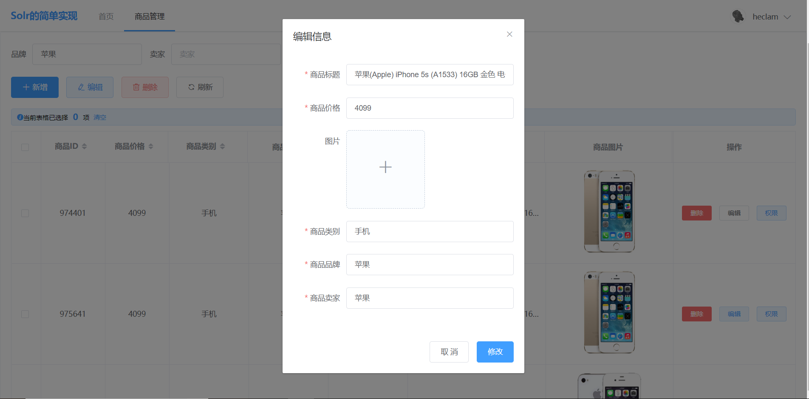
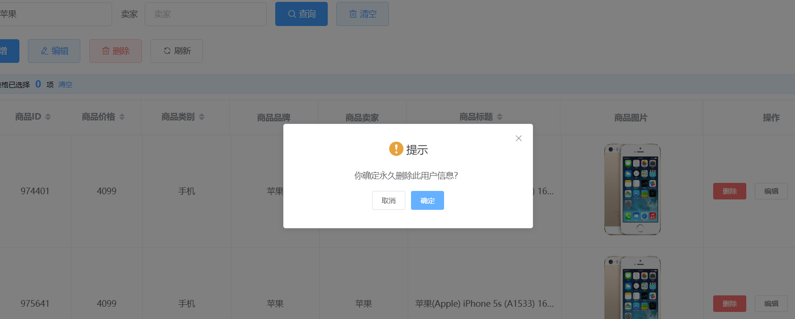

恩，现在就来讲一下这个项目吧 
这个项目登陆采用shiro认证，使用solr建立索引库，这样以来方便检索，solr采用ik中文分词器，缓存使用redis，商品管理页面采用SpringMVC上传图片 
环境搭建： 
     JDK1.8 
    tomcat9.0 
    MySQL5.7 
    shiro 
    redis 
    solr8.0 
    前端采用Vue+element的方式布局页面 
   下面来看一下展示的效果 
   **登陆界面** 采用Shiro进行认证，密码采用MD5加密，并实现了Shiro记住我的功能
    
    首页：登陆成功之后，采用solrTemplate查询索引,根据关键词查询，后台获取数据之后，通过vue+element展示在前端，后台分页采用了PageHepler,前端采用了element的分页
    
    
    
    看一下商品管理：可以根据品牌或卖家进行筛选
    
    添加新商品：
    
    编辑商品：
    
    删除商品：
    